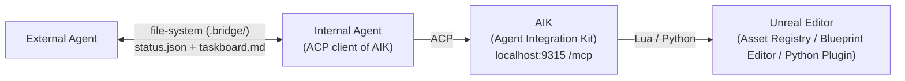
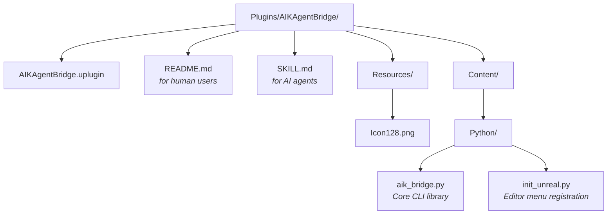

# AIK Agent Bridge

A file-system bridge that lets **external agents** delegate [Agent Integration Kit (AIK)](https://aik.betide.studio/) operations to an **internal ACP client agent** running inside Unreal Editor.

---

## What It Does

Agent Integration Kit (AIK) exposes a powerful MCP server at `localhost:9315`, but external agents (e.g., those running in a terminal, IDE extension, or remote environment) face several problems when talking to it directly:

- **Network boundaries** — External agents may not share the same localhost as the editor.
- **Context gaps** — AIK returns raw Lua/Python execution results; external agents lack real-time editor context such as viewport state, asset references, or compilation status.
- **Fragile coupling** — Editor restarts, C++ recompilation, or Live Coding can temporarily break the connection.
- **Capability gaps** — AIK's Lua layer cannot set certain C++-inherited Blueprint defaults or trigger PIE.

**AIK Agent Bridge solves this by decoupling the two sides:**

1. **External Agent** writes a task to a shared file inside the plugin directory.
2. **Internal Agent** (connected to AIK via **Agent Client Protocol**, or ACP) reads the task, executes it through AIK, and writes back the result.
3. **Bridge** is the only contract both sides need to understand.

---

## Architecture



Key points:
- The **internal agent** communicates with AIK over **ACP**, not by calling the MCP endpoint directly.
- The **external agent** never touches `localhost:9315`; it only reads and writes files under `Plugins/AIKAgentBridge/.bridge/`.

---

## Installation

1. Copy the `AIKAgentBridge` folder into your project's `Plugins/` directory.
2. Enable it in **Edit > Plugins > AIK Agent Bridge**.
3. Restart the editor.

Requirements:
- Unreal Engine 5.x
- **Python Script Plugin** enabled (declared as dependency)
- **Agent Integration Kit** enabled in your project

---

## Manual Usage (Editor Menu)

After startup, the plugin registers a menu bar item: **AIK Agent Bridge**

- **Initialize Bridge** — Create `.bridge/` files
- **Show Status** — Open `taskboard.md` in your default text editor
- **Submit Task...** — Manually submit a task via dialog
- **Resolve Task...** — Manually resolve the current task via dialog
- **Archive Task** — Archive and reset the board

These are useful for quick manual tests or when you want to hand off a task from inside the editor.

---

## CLI Quick Reference

The CLI is primarily designed for agent-to-agent automation, but you can also use it directly from a terminal.

```bash
# Initialize
python Plugins/AIKAgentBridge/Content/Python/aik_bridge.py init

# Submit a task
python Plugins/AIKAgentBridge/Content/Python/aik_bridge.py submit \
  --from ExternalAgent --to InternalAgent \
  --task "Create a WidgetBlueprint at /Game/UI/WBP_Hello" \
  --metadata '{"tool":"aik","action":"create_asset"}'

# Check status
python Plugins/AIKAgentBridge/Content/Python/aik_bridge.py status -v

# Resolve
python Plugins/AIKAgentBridge/Content/Python/aik_bridge.py resolve \
  --status completed --result "Done."

# Poll until terminal status (default: 10s interval, 24h timeout)
python Plugins/AIKAgentBridge/Content/Python/aik_bridge.py poll \
  --wait-for completed,blocked,cancelled -v

# Archive
python Plugins/AIKAgentBridge/Content/Python/aik_bridge.py archive
```

Environment variables:
- `AIK_BRIDGE_PROJECT_ROOT` — Override auto-detection of the project root.
- `AIK_BRIDGE_PLUGIN_DIR` — Override the plugin directory directly (bridge data lives at `{plugin_dir}/.bridge`).

---

## File Structure



---

## AI Agent Integration

If you are building an AI agent workflow:
- **External agents** should read `SKILL.md` for the submission protocol and metadata conventions.
- **Internal agents** running inside Unreal Editor should read `SKILL.md` for the polling loop, execution rules, and AIK interaction patterns.

### Protocol Rules

- **External agents must never call the AIK MCP endpoint (`localhost:9315`) directly.** All operations must be submitted through the bridge and executed by the internal agent.
- **External agents should poll via a background subagent.** After submitting a task and confirming the internal agent has locked it, launch a background subagent that polls every 10 seconds until the task reaches a terminal state (`completed`, `blocked`, or `cancelled`).
- **Internal agents should poll via a background subagent.** After reading `SKILL.md`, launch a background subagent that polls `status.json` every 10 seconds. When a `pending` task is found, execute it, resolve it, and immediately restart the polling subagent. Polling should continue indefinitely unless explicitly stopped.

---

## License

MIT or use as-is within your project.
